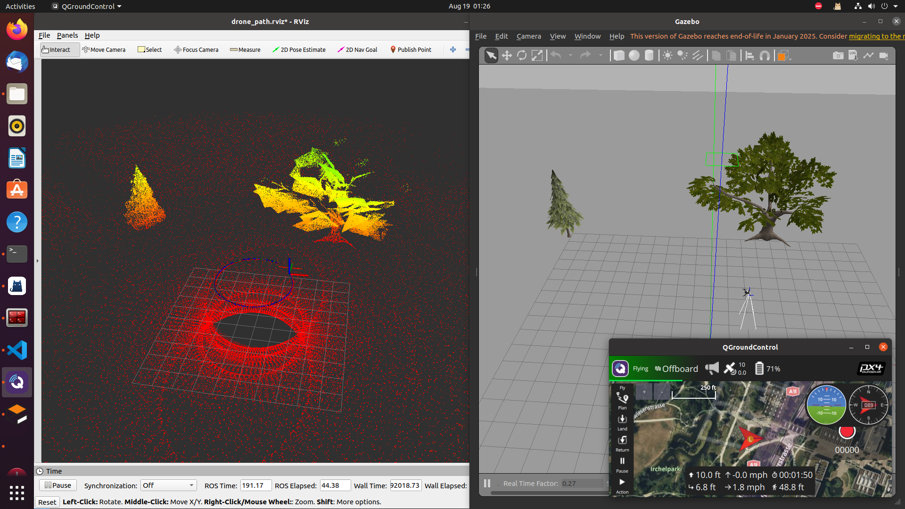
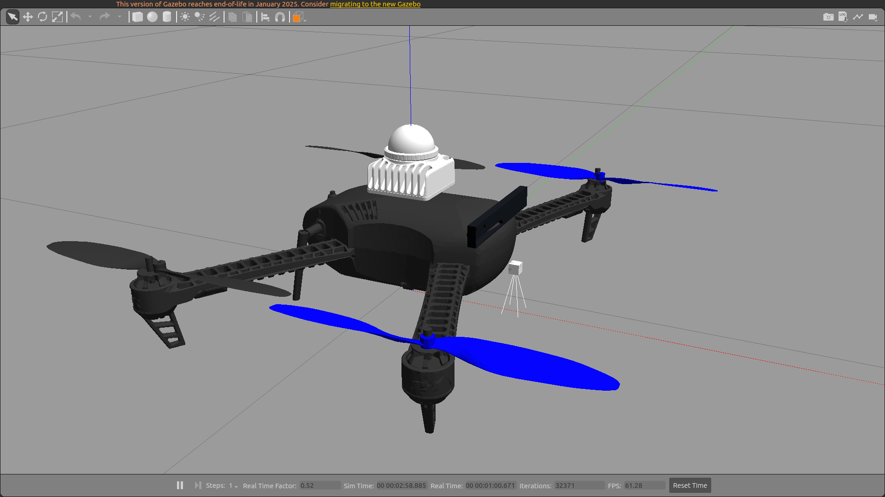
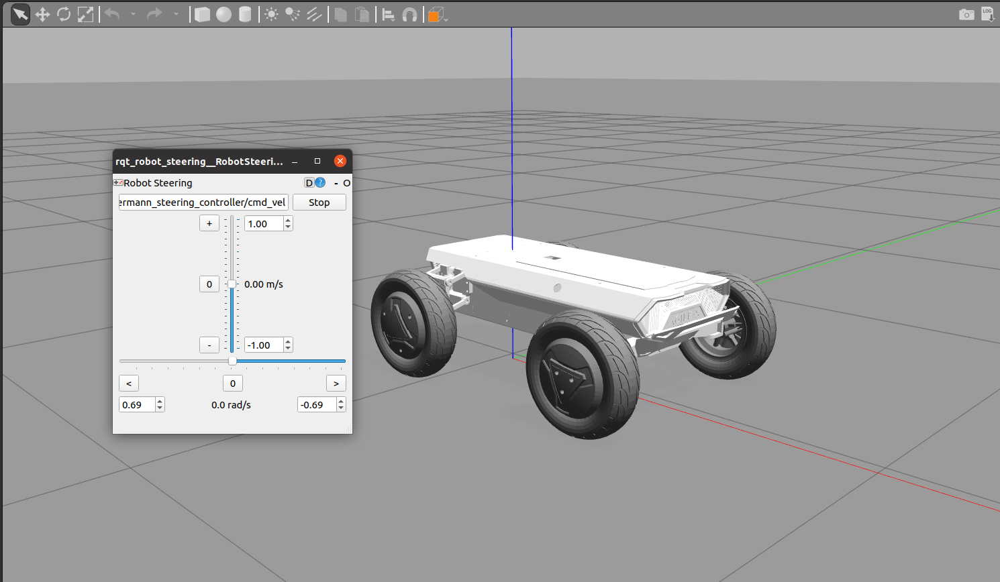
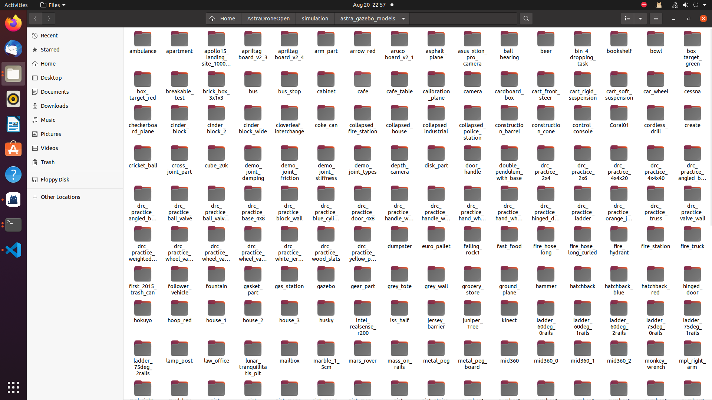
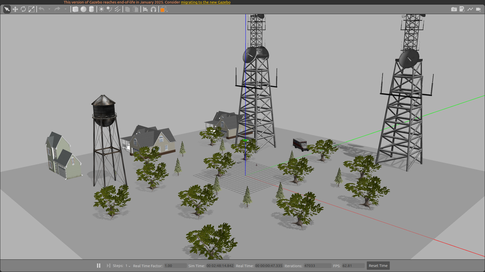

# AstraDroneOpen 无人机开源系统

AstraDroneOpen 是一套完整、模块化、高可拓展性的多旋翼无人机开源系统，结构清晰，目录完整，适用于学术研究、竞赛开发与产业落地。系统集成了视觉感知、定位建图、路径规划、飞行控制、集群通信、任务管理、仿真测试等核心功能，**解决了功能包相互冲突及自定义消息类型依赖问题**，支持 ROS 1 与 ROS 2 双环境。**同时支持仿真、实机**，无需二次移植到实机。

---

## 📁 1. 文件结构总览

本项目结构清晰，目录完整，是一个集成 ROS1/ROS2 双工作空间、飞控固件、仿真环境、硬件设计与多种第三方视觉/传感库的完整无人机研发平台，支持任务控制、感知识别、路径规划、SLAM、多机协同及全流程自动化构建运行,如果本项目内为空，请联系我们[微信号：Luli2225893438]。以下是本项目的文件结构：

> 开源项目：AstraDroneOpen, 交流QQ群：1059975794 , 商业合作（微信）：Luli2225893438

```
AstraDroneOpen/
├── AstraDrone_ros1_ws/              # ROS 1 工作空间（catkin）
│   ├── build/                       # 编译产物（git 忽略）
│   ├── devel/                       # catkin 开发环境（git 忽略）
│   └── src/                         # ROS1 核心源码（功能包按模块拆分）
│       ├── Communication/           # 通信接口：串口/UDP/ROS topic 封装
│       ├── Control/                 # 姿态/位置/速度控制器与参数
│       ├── Detection/               # 目标检测（视觉/LiDAR 等）
│       ├── Exploration/             # 自主探索与导航策略
│       ├── Land/                    # 安全降落/降落场识别
│       ├── MissionControl/          # 任务编排与状态机（任务切换/容错）
│       ├── Planner/                 # 路径/轨迹规划（全局+局部）
│       ├── SLAM/                    # 定位与建图（前端/后端/回环）
│       ├── Swarm/                   # 多机协同（编队/分布式通信）
│       ├── Track/                   # 目标跟踪（滤波/数据关联）
│       └── Utils/                   # 公共工具/消息定义/通用脚本
│       # 注：src/CMakeLists.txt 为 catkin 顶层符号链接；包内各自维护 CMakeLists.txt。
│
├── AstraDrone_ros2_ws/              # ROS 2 工作空间（colcon）
│   ├── build/                       # 编译产物（git 忽略）
│   ├── install/                     # 安装结果（git 忽略）
│   ├── log/                         # 构建与运行日志（git 忽略）
│   └── src/
│       ├── MissionControl/          # ROS2 任务控制（组件化/生命周期）
│       └── readme.md                # ROS2 模块说明（待补充）
│
├── docs/                            # 项目文档（中文为主）
│   ├── 00-AstraDrone开发教程.md      # 新手指南/项目总览/常见问题
│   ├── 01-安装脚本详解.md             # 一键安装脚本逐行解释与故障排查
│   ├── 02-仿真源码详细介绍.md         # 仿真工程结构/资源说明/调参
│   ├── 03-Ros源码详细介绍.md          # ROS 模块设计/接口/消息格式
│   ├── 04-硬件详细介绍.md             # 硬件组成/接线/调试建议
│   ├── 05-系统镜像详细介绍.md         # 系统镜像制作/烧录/版本管理
│   └── kexue.pdf                    # 科研/技术论文资料（只读）
│
├── hardware/                        # 硬件设计（占位与逐步开放）
│   ├── 3D_design/                   # 机械结构与外设装配
│   ├── BOM/                         # 物料清单（含替代件）
│   └── PCB_design/                  # 原理图/PCB（版本迭代中）
│
├── media/                           # 媒体资源
│   ├── image/
│   │   ├── pc_example.png           # PC 端示例界面
│   │   ├── forest_world.png         # 示例世界截图
│   │   └── hunter_se.png            # hunter_se演示图
│   └── video/
│       └── To_Be_Add                # 演示视频将陆续补充
│
├── scripts/                         # 工具与自动化脚本（优先使用 .bin 可执行）
│   ├── build_AstraDrone_ros1.bin    # ROS1 一键构建（含依赖检查）
│   ├── build_AstraDrone_ros1.sh     # 上述等价脚本（便于阅读修改）
│   ├── build_sim_workspace.bin      # 仿真一键构建
│   ├── build_sim_workspace.sh
│   ├── pc_installer.bin             # PC 端环境一键安装器
│   ├── pc_installer.sh
│   ├── onboard_installer.bin        # 机载端环境一键安装器
│   ├── onboard_installer.sh
│   ├── shc.sh                       # shell 可执行封装/加固
│   ├── env_sh/                      # 环境初始化与依赖管理
│   │   ├── 00_env_ubuntu_init.sh    # 基础系统/源/工具链
│   │   ├── 01_env_px4_init.sh       # PX4/FlightStack 相关
│   │   ├── 02_env_third_party_init.sh # 第三方库批量安装
│   │   ├── checkout_cmake_versions.sh # CMake 版本更换脚本
│   │   ├── cmake-install.sh         # CMake 自编译安装
│   │   └── ignore_packages.sh       # colcon/catkin 忽略清单生成
│   └── run_sh/                      # 运行与演示脚本
│       ├── echo.sh                  # 终端打印示例/环境验证
│       ├── onboard_example.sh       # 机载端演示启动
│       ├── pc_example.sh            # PC 端仿真/可视化启动
│       └── record.sh                # rosbag 录制与数据管理
│
├── simulation/                      # 仿真环境（Gazebo + PX4）
│   ├── astra_gazebo_models/         # 模型库（体量较大，目录不完全展开）
│   │   └── ...                      # 保留；提交前请确认无需全部跟踪
│   ├── astra_gazebo_worlds/         # 世界文件（示例/测试场景）
│   │   ├── forest.world
│   │   ├── example.world
│   │   ├── cangku.world
│   │   └── suv.world
│   ├── px4_sim_files/               # PX4 SITL 配置与启动
│   │   ├── px4_iris_params/         # 机体/控制参数
│   │   ├── px4_iris_sdf/            # 机体模型与传感器
│   │   └── px4_launch/              # 启动文件（多场景/多机）
│   └── sim_workspace/               # 仿真用 catkin 工作空间
│       └── src/
│
├── system_images/                   # 系统镜像与工具
│   └── To_Be_Add
│
├── third_party/                     # 内置第三方依赖（固定版本便于复现）
│   ├── apriltag/                    # AprilTag 算法（含多字典）
│   ├── GeographicLib/               # 地理/磁场/重力模型
│   ├── Livox-SDK/                   # Livox 雷达 SDK（v1）
│   ├── Livox-SDK2/                  # Livox 雷达 SDK（v2）
│   ├── lulese_aruco3.1.15/          # ArUco 标定/标记库
│   ├── nlopt/                       # 非线性优化库（轨迹/控制可用）
│   └── opencv-3.4.8/                # OpenCV 固定版本（兼容性验证）
│
├── LICENSE                          # 开源许可证
├── README.md                        # 顶层说明（快速开始/目录索引/FAQ）
└── README.pdf                       # PDF 版 README

```

## 🚀 2. 快速开始

### 2.1 仿真快速启动

#### 2.1.1 克隆项目

```bash
cd ~/ && git clone https://gitee.com/lulese/AstraDroneOpen.git  #配置px4环境需要配置github上网环境
```
> wget https://down.clashchinese.com/soft/clashchinese.com_Clash.for.Windows-0.20.39-x64-linux.tar.gz
>
#### 2.1.2 编译项目

本项目提供了众多编译的脚本，包括`00_env_ubuntu_init.sh`、`01_env_px4_init.sh`、`02_env_third_party_init.sh`为基本环境配置脚本，主要安装了ros noetic，code ，px4 ，编译ros工作空间所需的第三方库。`build_AstraDrone_ros1.bin`、`build_sim_workspace.bin`为工作空间的编译脚本，这两个脚本会删除原有的编译文件，重新编译，所以编译比较费时，推荐在第一次编译时使用。

如果是个全新的环境（刚刚装好ubuntu），可以使用一键配置脚本，脚本会顺序执行上述五个脚本，运行之前首先需要检查网络(能连接到Github)：

```bash 
cd ~/AstraDroneOpen/ && sudo chmod 777 ~/AstraDroneOpen/scripts/*
./scripts/pc_installer.bin
```

> 如果报错了，请定位到报错的步骤，然后单独运行相应脚本，再定位具体的问题，复制报错内容或者截图，发布issue共同解决或者进群咨询。
>

如果想单独编译ros1工作空间，请你单独使用这个脚本来编译：

~~~shell
cd ~/AstraDroneOpen/AstraDrone_ros1_ws/   #进入工作空间
./build_AstraDrone_ros1.bin               #编译
~~~


#### 2.1.3 启动程序

编译完成之后，我们仍然提供了一键运行脚本来启动仿真程序，启动fast-lio2, Offboard控制模式, 控制无人机基本飞行。

需要把地面站的虚拟摇杆打开就不会报警告（No manual control input），开启位置在（左上角QGC图标-application settings-常规-虚拟游戏手柄）。
~~~
cd ~/AstraDroneOpen/
./scripts/run_sh/pc_example.sh
~~~

无人机会自动解锁（需要等待一分钟, 如果没有起飞，可以尝试地面站手动解锁飞机），飞圆形或者正方形，飞两圈自动降落。



### 2.2 机载电脑快速启动

#### 2.1.1 克隆项目

```bash
cd ~/ && git clone https://gitee.com/lulese/AstraDroneOpen.git
```

#### 2.1.2 编译项目（还未完善）

本项目提供了众多编译的脚本，包括`00_env_ubuntu_init.sh`、`01_env_px4_init.sh`、`02_env_third_party_init.sh`为基本环境配置脚本，主要安装了ros noetic，code ，px4 ，编译ros工作空间所需的第三方库。`build_AstraDrone_ros1.bin`、`build_sim_workspace.bin`为工作空间的编译脚本，这两个脚本会删除原有的编译文件，重新编译，所以编译比较费时，推荐在第一次编译时使用。

如果是个全新的环境（刚刚装好ubuntu），可以使用一键配置脚本，脚本会顺序执行上述五个脚本，运行之前首先需要检查网络(能连接到Github)：

```bash 
cd ~/AstraDroneOpen/ && sudo chmod 777 ~/AstraDroneOpen/scripts/*
./scripts/pc_installer.bin
```

> 如果报错了，请定位到报错的步骤，然后单独运行相应脚本，再定位具体的问题，复制报错内容或者截图，发布issue共同解决或者进群咨询。
>

如果想单独编译ros1工作空间，请你单独使用这个脚本来编译,：

~~~shell
cd ~/AstraDroneOpen/AstraDrone_ros1_ws/   #进入工作空间
./build_AstraDrone_ros1.bin               #编译
~~~


#### 2.1.3 启动程序（还未完善）

编译完成之后，我们仍然提供了一键运行脚本来启动仿真程序，控制无人机基本飞行。

~~~
cd ~/AstraDroneOpen/
./scripts/run_sh/onboard_example.sh
~~~


## 📦3. 重要模块说明

### 3.1 Ros1源码
如果本项目内为空，请联系我们[微信号：Luli2225893438]。
|      模块       |                  描述                          |        现有功能包         |
| :-------------: | :--------------------------------------------: | :----------------------: |
| Track/          | 二维码识别与跟踪、YOLO目标检测追踪              | aruco_track、yolo_track |
| SLAM/           | 实时定位建图（支持激光雷达、深度相机、融合）     | Fast-LIO2、FreeDOM、A-LOAM |
| Planner/        | 路径搜索与轨迹生成（全局/局部、多种规划策略）    | Fast-Planner、ego-planner |
| Control/        | 无人机控制器（位置 / 速度 / 姿态级控制）         | px4_controller |
| Detection/     | 目标检测、深度估计、相机-激光融合               | YOLO、stereo_fusion |
| Exploration/    | 无人探索、区域遍历、基于前沿的探索策略           | frontier_exploration |
| Swarm/          | 多机协同、分布式控制、编队飞行                  | swarm_control |
| MissionControl/ | 起飞、打点、降落、巡逻等任务管理                | astra_mission_control |
| Land/           | 基于二维码与传感器的精确降落程序                 | pid_land_ctrl、tag_land |
| Communication/  | 多机通信、遥控信号、串口数据、4G链路、状态转发   | mavros_extend、link_bridge |
| Utils/          | 常用小工具与通用功能模块（可视化、坐标变换、调试） | rviz_tools、tf_tools |

`Utils` 现有功能包：

| 模块名称            | 功能描述                                                                 |
| ------------------- | ------------------------------------------------------------------------ |
| `astra_custom_msgs` | 自定义消息定义包，供其他功能包依赖，编译时需最先构建。                     |
| `camera_sdk`        | MJPG 单目相机驱动，支持断线重连与长时间稳定运行。                          |
| `catkin_simple`     | catkin 编译辅助工具，简化 CMake 构建流程。                                |
| `cv_bridge`         | ROS 与 OpenCV 的图像消息格式转换桥接。                                    |
| `fake_slam`         | 在仿真中使用真实位姿和点云进行建图，模拟 SLAM 效果。                       |
| `imu_2_euler`       | 将 IMU 原始姿态数据转换为欧拉角（pitch、roll、yaw）。                      |
| `lidar_cam_fusion`  | 利用雷达与相机内/外参，实现点云上色与像素坐标对应深度信息服务。              |
| `livox_ros_driver`  | Livox 雷达 ROS 驱动（旧版）。                                             |
| `livox_ros_driver2` | Livox 雷达 ROS 驱动（新版，推荐使用）。                                    |
| `pixel2map`         | 将图像像素结合深度与相机内参，转换为局部坐标系 3D 点。                      |
| `pointcloudcut`     | 对点云话题进行空间区域裁剪。                                               |
| `pub_cam_info`      | 发布相机内参 YAML 文件，生成 ROS 相机内参话题。                             |
| `rc_topic`          | 从遥控器读取指定通道值，并发布为 `bool` 类型 ROS 话题。                     |
| `rtk2local`         | 将 GPS/RTK 全球坐标系转换为局部 FLU 坐标系，并支持控制指令坐标转换。        |
| `serial`            | 串口通信功能包，用于与外部设备交互。                                       |
| `topic_tf_tran`     | ROS 中 pose/odometry 与 tf 坐标变换的互转。                                |

---

### 3.2 Ros2源码

目前在ros2 humble中已经测试过.


### 3.3 仿真环境介绍

本项目整合了大量gazebo模型，并提供带有mid360，下视摄像头，前视摄像头的飞机模型，可以在本项目中随意搭建环境，运行fast-lio，fast-planner、ego-planner等主流开源程序。

##### 3.3.1 机器人模型

无人机模型，带有平放mid360雷达（带imu），前视深度摄像头，下视单目摄像头: 


松灵的hunter_se模型，带有控制器: 


##### 3.3.2 静态模型
静态模型: 


##### 3.3.3 世界模型

房屋森林模型: 



### 3.4 脚本介绍

本项目功能包众多，难免会产生功能包重名冲突的情况，为了便于管理多个功能包，使用`CATKIN_IGNORE`文件来忽略工作空间中重名的功能包，所以`build_AstraDrone_ros1.bin`文件可以指定某个功能包不编译，便于开发者对不同算法性能进行对比，目前脚本提供以下功能：

##### 2.1.2.1 help标签

会输出加入功能包和排除功能包的基本语法：

~~~
astra2@ubuntu:~/AstraDroneOpen$ ./scripts/build_AstraDrone_ros1.bin --help
扫描包集合目录...
用法: ./scripts/build_AstraDrone_ros1.bin [选项]
选项:
  --include <集合>    移除集合目录 CATKIN_IGNORE（启用该集合）。支持 'Set' 或 'Cat/Set'
  --exclude <集合>    在集合目录添加 CATKIN_IGNORE（禁用该集合）。支持 'Set' 或 'Cat/Set'
  --list              按 两级结构 显示：类别/集合
  --state             基于集合（两级）递归检测 CATKIN_IGNORE，输出 会编译/不编译（类别/集合）
  --help              显示此帮助信息

示例：
  ./scripts/build_AstraDrone_ros1.bin --include Fast-Planner --exclude ego-planner
  ./scripts/build_AstraDrone_ros1.bin --exclude ego-planner
~~~

##### 2.1.2.2 list标签

可以查看当前项目可用功能包（目前只有ros1版本）：

~~~
astra2@ubuntu:~/AstraDroneOpen$ ./scripts/build_AstraDrone_ros1.bin --list
扫描包集合目录...
可用集合（两级：类别/集合）：
  Communication/
    Communication/serial_tool
  MissionControl/
    MissionControl/astra_uavoffbard_frame
  Perception/
    Perception/apriltag_ros
    Perception/aruco_localization
    Perception/target_prediction
  Planner/
    Planner/ego-planner
~~~

##### 2.1.2.2 state标签

查看当前哪些包会编译，哪些包不会编译

~~~
astra2@ubuntu:~/AstraDroneOpen$ ./scripts/build_AstraDrone_ros1.bin --state
扫描包集合目录...
====== 当前编译状态（集合级，类别/集合） ======
将会编译（未发现 CATKIN_IGNORE）的集合：
  Communication/
    Communication/serial_tool
  MissionControl/
    MissionControl/astra_uavoffbard_frame
  Perception/
    Perception/apriltag_ros
    Perception/aruco_localization

不会编译（被 CATKIN_IGNORE 忽略）的集合：
  Planner/
    Planner/Fast-Planner
===========================================
~~~

##### 2.1.2.2 include和exclude标签

通过`include`和`exclude`来控制某个功能包是否编译，注意区分大小写，一个标签后面只能带一个包名。

~~~
./scripts/build_AstraDrone_ros1.bin --include Fast-Planner --exclude ego-planner
~~~

#### 


## 📄4. 文档导航

| 文档路径 | 内容说明 |
| --- | --- |
| [docs/00-AstraDrone开发教程.md](docs/00-AstraDrone开发教程.md) | 新手入门、项目总览、常见问题（强烈建议先读） |
| [docs/01-安装脚本详解.md](docs/01-安装脚本详解.md) | 一键安装脚本逐步解析与故障排查 |
| [docs/02-仿真源码详细介绍.md](docs/02-仿真源码详细介绍.md) | 仿真工程结构、资源说明与调参要点 |
| [docs/03-Ros源码详细介绍.md](docs/03-Ros源码详细介绍.md) | ROS 源码结构、模块接口、消息与话题规范 |
| [docs/04-硬件详细介绍.md](docs/04-硬件详细介绍.md) | 硬件组成、接线规范、调试与注意事项 |
| [docs/05-系统镜像详细介绍.md](docs/05-系统镜像详细介绍.md) | 系统镜像制作流程、烧录步骤与版本管理 |
| [docs/kexue.pdf](docs/kexue.pdf) | 科研/技术资料（只读） |


---


## 🧰 5. 推荐硬件列表

- **飞控**：Pixhawk6c mini
- **主控**：Jetson Nano / Orangepi / NUC13
- **雷达**：Livox / Velodyne / Ouster
- **相机**：工业相机 / RealSense / 鱼眼相机
- **通信**：Lora串口板 / 数传 / 4G 模块
- **电调+电机**：T-Motor / Dji / 微空 等

详细请查看 `hardware/` 目录。

---


## 💽 6. 系统镜像使用说明

### 6.1 下载镜像

镜像文件位于 `system_images/` 目录。

### 6.2 烧录方式

使用以下任意工具将镜像烧录到存储介质：

- **推荐**：balenaEtcher（图形界面）
- **命令行**：`dd if=xxx.img of=/dev/sdX bs=4M`

### 6.3 启动并使用

1. 插入 TF 卡/U盘 启动设备
2. 系统将自动加载 ROS 环境与核心模块

---

## 🤝7. 加入贡献

欢迎开发者和用户参与到 AstraDroneOpen 的建设中：

- 📌 提交 PR（新功能、优化、修复）
- 🐞 报告 Bug 与兼容性问题
- 📖 完善文档或翻译
- 🔄 推动 ROS2 适配
- 💻 添加 Jetson / x86 / orangepi 支持

---

## 📬8. 联系与反馈

- **Issues**：欢迎在 GitHub /Gitee 提交 Bug、功能建议或讨论
- **邮箱**：luli15291628995@163.com
- **视频教程**：详见项目主页或 B 站链接

---

## 📜9. License

本项目采用 MIT License 开源，详见 LICENSE。

---

**让无人机飞入科研、竞赛与实际应用场景，AstraDroneOpen 期待与您共同探索未来！**
